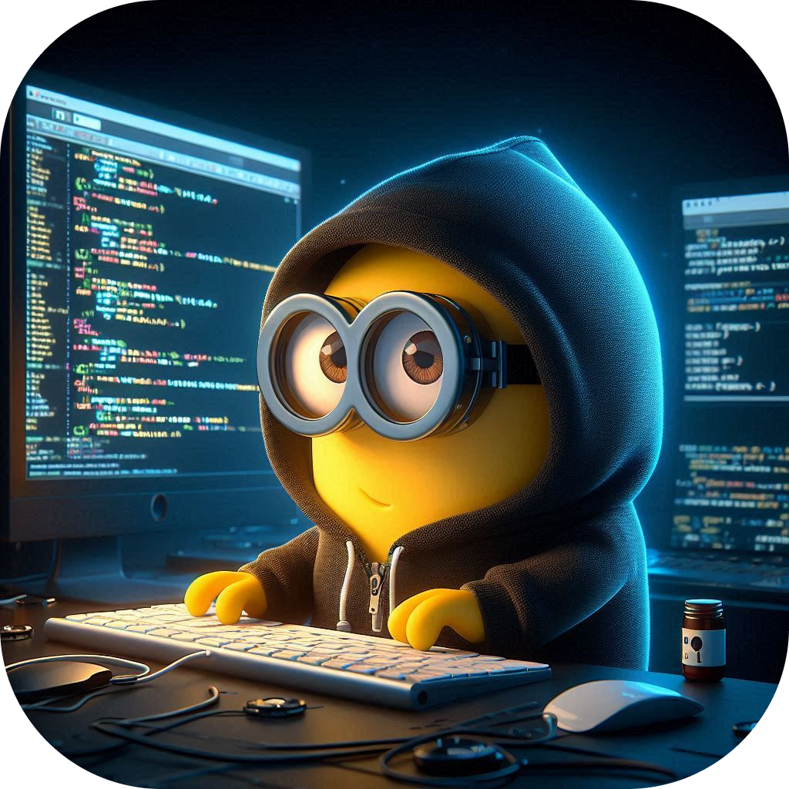

    
    <h3 align="center">Minion Lang</h3>

**MinionLang** is a playful, **interpreter-based** programming language designed for delightful learning pursposes. Crafted with Go, MinionLang is a beginner-friendly language that introduces fundamental programming concepts in a fun and interactive way.

## Examples
Coming soon.

## Community

**Telegram Channel:** [@geek_engineers](https://t.me/geek_engineers)

## Maintainers

- [Tahadostifam](https://github.com/tahadostifam)

## Contribution
We welcome contributions from the community to improve MinionLang. Whether you're a seasoned developer or just starting out, your help is valuable.

**Here's how you can contribute:**

- Report Issues: If you find a bug or have a feature request, please open an issue on our GitHub repository.

- Fix Bugs: Contribute bug fixes and improvements to the codebase.

- Add New Features: Implement new features to enhance MinionLang's capabilities.

- Write Documentation: Create clear and concise documentation to help users learn and use MinionLang.

- Review Pull Requests: Help us maintain code quality by reviewing pull requests from other contributors.

- To get started, fork the repository, make your changes, and submit a pull request. We'll review your contribution and provide feedback.

Thank you for your support!
